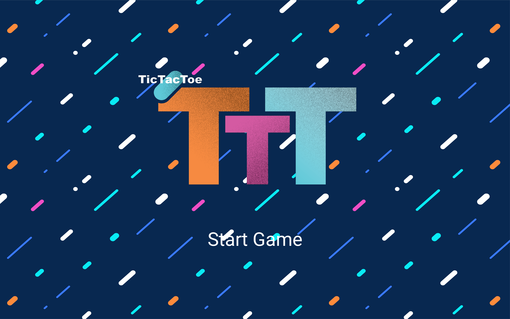
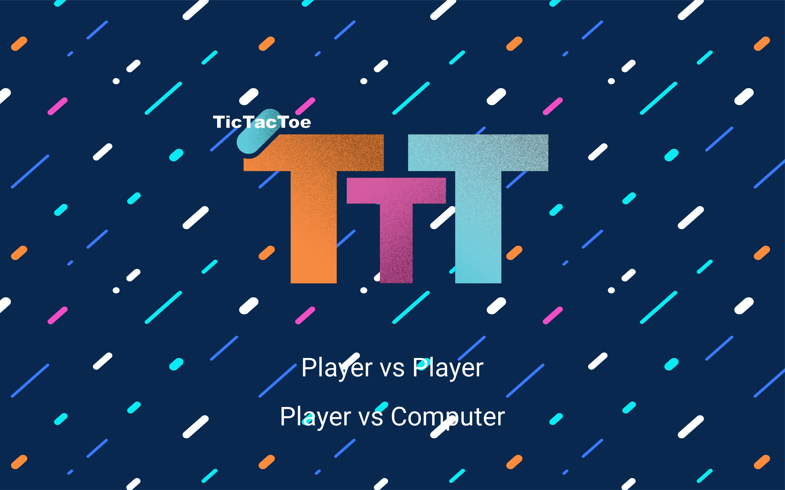
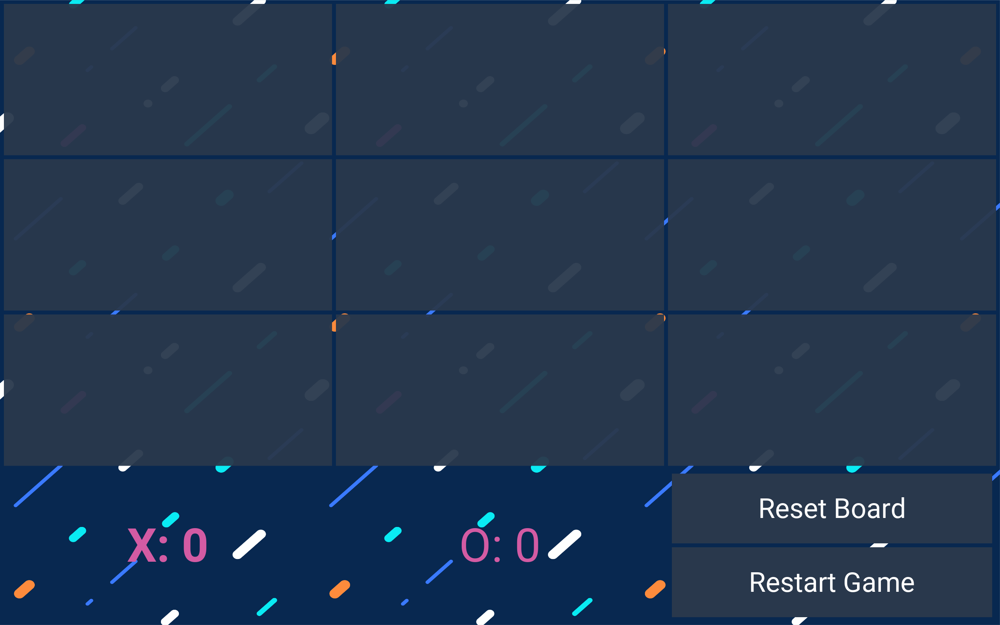
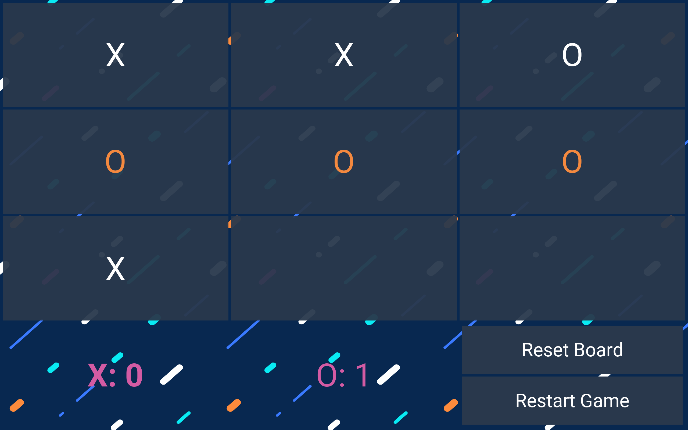

# TicTacToe
Simple implementation of Two Player Tic-Tac-Toe game using Python and Kivy.  

  

  
   

  
This program was created for learning purposes.  
TO DO:   
- [x] player vs player
- [x] player vs ai
  - [x] comp goes through finite series of instructions to compute a move (ai.py)
  - [x] ai minimax algo (newai.py)
    - [x] comp starts first 
    - [ ] player starts first
    - [x] currently comp's first move is top left corner. top left corner = fewer ways to win. Make comp pick more    traditional middle square as his first move.
